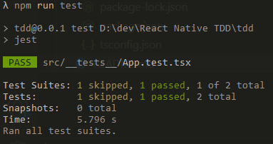

# TDD - React Native

April 2021

> 🔨 From udemy: [[TDD] Développement piloté par les tests avec React Native - Teddy Morin](https://www.udemy.com/course/tdd-developpement-pilote-par-les-tests-avec-react-native/)

---

## Development tools

### OpenJDK

- `sudo apt-get update`
- `sudo apt install default-jre`
- `java -version`

### Android sdk platform

`sudo apt-get install android-sdk-platform-tools-common`

### ADB & Fastboot

- `sudo apt-get update`
- `sudo apt-get install android-tools-adb android-tools-fastboot`

Some commands:

- `adb version`
- `adb start-server`
- `adb kill-server`

Test devices linked: `adb devices`

If you're developing on Ubuntu Linux, you need to add a udev rules file that contains a USB configuration for each type of device you want to use for development. In the rules file, each device manufacturer is identified by a unique vendor ID, as specified by the ATTR{idVendor} property.

Check that repo to easily install them: [snowdream/51-android](https://github.com/snowdream/51-android).

### Android emulator: scrcpy

#### Ubuntu

- `sudo apt-get update`
- `sudo apt install scrcpy`
- `chmod 755 android/gradlew`

#### WSL 2 / Windows

ADB won't work in WSL 2 using usb.

Install Powershell (admin) version:

Using [Chocolatey](https://chocolatey.org/install)

- Run Get-ExecutionPolicy. If it returns Restricted, then run Set-ExecutionPolicy AllSigned or Set-ExecutionPolicy Bypass -Scope Process.
  `Set-ExecutionPolicy Bypass -Scope Process -Force; [System.Net.ServicePointManager]::SecurityProtocol = [System.Net.ServicePointManager]::SecurityProtocol -bor 3072; iex ((New-Object System.Net.WebClient).DownloadString('https://chocolatey.org/install.ps1'))`

Then:

`choco install adb`
`choco install scrcpy`

- Make sure you [enabled adb debugging](https://developer.android.com/studio/command-line/adb.html#Enabling) on your device(s).

Plug usb cable.
In Powershell (admin)
`adb start-server`
`adb devices`

It should display the device number then _device_. If its written _unauthorized_ instead _device_, use that procedure: [How To Fix ADB Device Unauthorized Message On Android](https://www.addictivetips.com/android/fix-adb-device-unauthorized-message-android/)

#### Test

`scrcpy`: it should display a clone image of your Android device on your computer screen.

## Android emulator: Android Studio

Tools / AVD manager


## ESlint / Prettier

Add this to avoid some errors in your IDE.

**.eslintrc.js**

```js
module.exports = {
  root: true,
  extends: "@react-native-community",
  rules: {
    "prettier/prettier": [
      "error",
      {
        endOfLine: "auto",
      },
    ],
    quotes: [2, "double", { avoidEscape: true }],
  },
};
```

**.prettierrc.js**

```js
module.exports = {
  bracketSpacing: false,
  jsxBracketSameLine: true,
  singleQuote: false,
  trailingComma: "all",
  arrowParens: "avoid",
};
```

## Create React native app

`npx react-native init tdd --template react-native-template-typescript`

`cd tdd`

`npx react-native run-android`


It should open the demo app in your Android emulator.


## Jest:

### First test

`npm i --save-dev @types/jest`

```
--src
----__test__
----App.test.tsx
App.tsx
```

**src/**tests**/App.test.tsx**

```ts
function add(a: number, b: number) {
  return a + b;
}

describe("App", () => {
  test("first test", () => {
    expect(add(2, 2)).toBe(4);
  });
});
```

`npm run test`


### Component test / React test renderer

**src/**tests**/App.test.tsx**

```ts
import React from "react";
import renderer from "react-test-renderer";
import App from "../App";

describe("App", () => {
  // Should / When
  test("should render correctly", () => {
    renderer.create(<App />);
  });
});
```

`npm run test`


## React Native Testing Library

`npm i @testing-library/react-native`

**src/**tests**/App.test.tsx**

```ts
import React from "react";
import { render } from "@testing-library/react-native";
import App from "../App";

describe("App", () => {
  // Should / When
  test("should render correctly", () => {
    render(<App />);
  });
});
```

`npm run test`


Then, we create a real test. **This test will fail**. It's the **TDD** approach: first write the test then update the module targeted by the test.

**src/**tests**/App.test.tsx**

```ts
import React from "react";
import { render } from "@testing-library/react-native";
import App from "../App";

describe("App", () => {
  // Should / When
  test("should render correctly", () => {
    const wrapper = render(<App />);
    wrapper.getByTestId("app");
  });
});
```

`npm run test`


**src/App.tsx**

```ts
  return (
    <View testID="app">
    // ...
    </View>
```

`npm run test`



## The App

**package.json**

Add watch:

```json
  "scripts": {
    "test:watch": "jest --watch",
  },
```

This feature uses git on local so if it hasn't been done yet: `git init`

Then: `npm run test:watch`

## Dependancies

- [@types/jest](https://www.npmjs.com/package/@types/jest): This package contains type definitions for Jest.

`npm i --save-dev @types/jest`

- [@testing-library/react-native](https://www.npmjs.com/package/@testing-library/react-native): Simple and complete React Native testing utilities that encourage good testing practices.

`npm i @testing-library/react-native`

- [react-native-linear-gradient](https://www.npmjs.com/package/react-native-linear-gradient): A <LinearGradient> component for react-native, as seen in react-native-login.

`npm i react-native-linear-gradient`

- [moment](https://www.npmjs.com/package/moment): https://www.npmjs.com/package/moment

`npm i moment`

## Useful links

- [Genymobile/scrcpy](https://github.com/Genymobile/scrcpy)
- [Cmder](https://cmder.net/)
- [Intégrer Cmder à Visual Studio Code](https://blog.juansorroche.com/integrer-cmder-a-visual-studio-code)
- [snowdream/51-android](https://github.com/snowdream/51-android)
- [React native - Using TypeScript](https://reactnative.dev/docs/typescript)
- [Testing with Jest](https://docs.expo.io/guides/testing-with-jest/)
- [Redux-Saga](https://redux-saga.js.org/)
- ***
